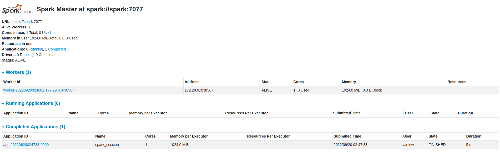

# Airflow + Spark Docker environment
> Local containerized environment for development using Docker, Airflow and Spark.

## Table of Contents
* [General Info](#general-information)
* [Useful Articles](#useful-articles)
* [Technologies Used](#technologies-used)
* [Screenshots](#screenshots)
* [Setup](#setup)
* [Usage](#usage)
* [Project Status](#project-status)
* [Room for Improvement](#room-for-improvement)
* [Contact](#contact)


## General Information
- This project aims to provide a quick and easy way to provision a local development environment with Airflow and Spark for data enthusiasts.
- Here we use as a base the docker-compose.yaml available on the Airflow website. We extend the image to install our requirements and modify the services in docker-compose.yaml according to our needs.

## Useful Articles

- [Running Airflow in Docker](https://bit.ly/3Ukopke)
- [Building the Airflow image](https://bit.ly/3r9AVG5)
- [Docker Image for Apache Airflow](https://bit.ly/3dyXDE2)
- [Airflow Architecture Overview](https://bit.ly/3qXbHdz)
- [Apache Spark packaged by Bitnami](https://bit.ly/3BVm6gw)

## Technologies Used
- Tech 1 - Docker/Docker compose
- Tech 2 - Airflow 2.3.4 - [Docker image](https://bit.ly/3BSZRYt)
- Tech 3 - Spark latest - [Docker image](https://bit.ly/3S4eeio)


## Screenshots





## Setup

- [Install Docker](https://bit.ly/3LvbVCw);

- [Install Docker compose](https://bit.ly/3Sz57WP);

## Usage

```
git clone git@github.com:razevedo1994/airflow_and_spark_docker_environment.git
```

```
mkdir -p ./logs ./plugins
echo -e "AIRFLOW_UID=$(id -u)" > .env
```

```
chmod +x ./build_environment.sh ./reset_environment.sh
```

```
./build_environment.sh
```

- Create this connection on Airflow:


- **Attention**: If you want to clean up your environment run `./reset_environment.sh` . But be careful, this command will delete all your images and containers.


## Project Status
Project is: _in progress_


## Room for Improvement

--

## Contact
Created by [Rodrigo Azevedo](https://www.linkedin.com/in/azevedo94/) - feel free to contact me!
